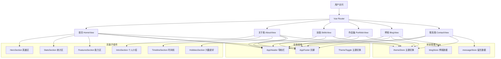

# 个人网页 - 项目设计文档

## 1. 系统架构



## 2. 页面规划与交互设计

| 页面 | 路由 | 核心交互 | Vue 技术点 |
|------|------|----------|-----------|
| 首页 HomeView | `/` | 打字机动画、数字递增动画、滚动指示器 | `ref`, `reactive`, `onMounted`, 模板引用, `$emit` 组件通信 |
| 关于我 AboutView | `/about` | 时间线展开/收起详情、滚动渐入动画 | `v-show`, `<transition>`, `v-for`, 自定义指令 `v-lazy` |
| 技能 SkillsView | `/skills` | Tab 分类切换、进度条动画、环形进度 | `computed`, `watch`, `<transition-group>`, 动态 `:style` |
| 作品集 PortfolioView | `/portfolio` | 标签筛选、卡片过渡动画 | `v-for`, `computed`, `<transition-group>`, 自定义指令 `v-lazy` |
| 博客 BlogView | `/blog` | 搜索过滤、分类筛选、分页 | `v-model`, Pinia, `computed`, `<el-pagination>` |
| 联系我 ContactView | `/contact` | 表单验证提交、留言板 | `v-model`, `el-form :rules`, `ref` 模板引用, Pinia |

## 3. UI/UX 规范

### 色彩体系
- 主色调: `#6C63FF` (靛蓝紫)
- 辅助色: `#FF6584` (珊瑚粉)
- 成功色: `#00C9A7`
- 警告色: `#FFC75F`
- 背景色: `#0F0E17` (深色模式) / `#F8F9FE` (浅色模式)
- 卡片背景: `#16213E` (深色) / `#FFFFFF` (浅色)
- 文字主色: `#2D3436` (浅色) / `#FFFFFF` (深色)
- 文字次色: `#636E72` (浅色) / `#B2BEC3` (深色)

### 字体
- 标题: `'Poppins', sans-serif`
- 正文: `'Inter', 'PingFang SC', 'Microsoft YaHei', sans-serif`
- 代码: `'Fira Code', monospace`

### 间距系统
- 基础单位: 4px
- 常用: 4px / 8px / 16px / 24px / 32px / 48px / 64px

### 圆角
- 小: 4px
- 中: 8px
- 大: 16px / 24px
- 圆: 50%

### 阴影
- 卡片: `0 4px 24px rgba(108, 99, 255, 0.08)`
- 悬浮: `0 12px 40px rgba(108, 99, 255, 0.18)`

## 4. 项目结构

```
frontend-user/
├── public/
│   └── vite.svg
├── src/
│   ├── api/
│   │   └── index.js              # API 封装（Axios 拦截器）
│   ├── assets/styles/
│   │   ├── variables.scss        # 设计系统变量
│   │   └── global.scss           # 全局样式
│   ├── components/
│   │   ├── AppHeader.vue         # 导航栏（路由导航、响应式菜单）
│   │   ├── AppFooter.vue         # 页脚（快速导航、技术栈展示）
│   │   ├── ThemeToggle.vue       # 主题切换按钮
│   │   ├── home/
│   │   │   ├── HeroSection.vue   # 首页英雄区（打字机动画、粒子背景）
│   │   │   ├── StatsSection.vue  # 首页统计区（数字递增动画）
│   │   │   └── FeaturesSection.vue # 首页能力展示区
│   │   └── about/
│   │       ├── IntroSection.vue  # 关于页个人介绍
│   │       ├── TimelineSection.vue # 关于页时间线
│   │       └── HobbiesSection.vue  # 关于页兴趣爱好
│   ├── directives/
│   │   └── lazy.js               # 自定义指令 v-lazy（滚动渐入）
│   ├── utils/
│   │   └── logger.js             # 前端日志系统
│   ├── views/
│   │   ├── HomeView.vue          # 首页
│   │   ├── AboutView.vue         # 关于我
│   │   ├── SkillsView.vue        # 技能
│   │   ├── PortfolioView.vue     # 作品集
│   │   ├── BlogView.vue          # 博客
│   │   └── ContactView.vue       # 联系我
│   ├── stores/
│   │   ├── theme.js              # 主题状态管理
│   │   ├── blog.js               # 博客数据管理
│   │   └── message.js            # 留言数据管理
│   ├── router/
│   │   └── index.js              # 路由配置（懒加载、导航守卫）
│   ├── App.vue                   # 根组件
│   └── main.js                   # 入口文件
├── Dockerfile
├── nginx.conf
├── package.json
├── vite.config.js
└── index.html
```
